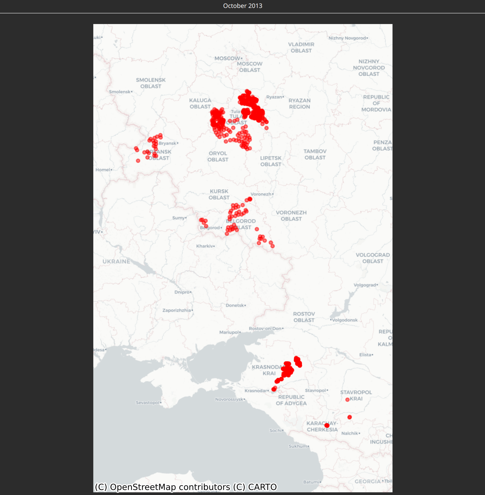

# json2anki

A small python project to convert a json file from map-making.app to an anki deck. On the front sides of the cards will be the names of the tags you have set and on the backside a render of where the locations are that have that tag set.

An example from finbarr's russia long antenna json:


# Usage

## Requirements

- You must have a recent version of python installed

## Preparation

To prepare the execution of the converter tool, create and activate a python virtual environment. (You can also install the required packages globally in your system, but it is usually more comfortable using virtual environments)

### Windows
1. Create a python virtual environment (This step is not necessary if the environment already exists):
```powershell
python3 -m venv .venv
```

2. Activate the virtual environment:

If this step fails with an error message similar to "[...]Activate.ps1 cannot be loaded because running scripts is disabled on this system [...]", try setting the execution policy for the user using this command: `Set-ExecutionPolicy -ExecutionPolicy RemoteSigned -Scope CurrentUser`
```powershell
.\.venv\bin\activate
```

3. Install all required packages inside the virtual environment (This step is not necessary if you have already done this in your virtual environment):
```powershell
pip install -r requirements.txt
```

### Linux
1. Create a python virtual environment (This step is not necessary if the environment already exists):
```bash
python3 -m venv .venv
```

2. Activate the virtual environment:
```bash
source .venv/bin/activate
```

3. Install all required packages inside the virtual environment (This step is not necessary if you have already done this in your virtual environment):
```bash
pip install -r requirements.txt
```

## Executing the tool

To execute, the tool, run the following command after setting up your virtual environment:
```bash
python3 json2anki.py
```

By default the tool will expect there to be a locs.json file it will read and will output a deck.apkg file. You can change this behaviour using command line arguments.

### Command line arguments

To get a short description for every command line argument, use the one of the following commands:

```bash
python3 json2anki.py -h
``` 

or 

```bash
python3 json2anki.py --help
```